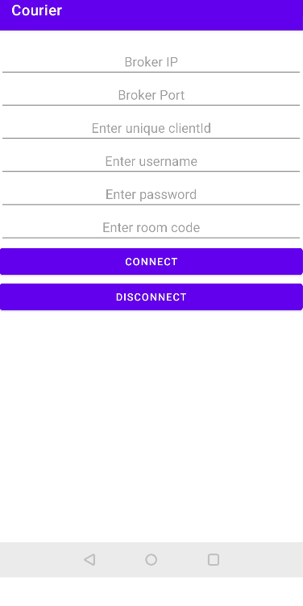

# Android Setup

Android sample application for this end-to-end example can be found [here][1]

## Running the android application

- Clone [this github project][2], if not already done.
- On your android studio, open project my selecting the `example-android` directory inside the cloned project.
- Execute command `./gradlew installDebug` to run the application.

## Interface

- Enter broker IP, broker port, client id, username, password and room code to make the connection.

- On clicking the **CONNECT** button, courier library will make the MQTT connection using the provided connect options and a new screen will appear where all sent/received messages can be seen.

[1]: https://github.com/gojek/courier/tree/main/example-android
[2]: https://github.com/gojek/courier
