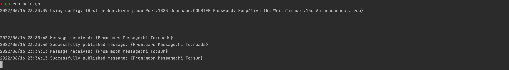

# Go Backend Setup

You need to run the Go backend so that it receives the messages from the public broker and relays it to respective groups. For this you will need [Go](https://go.dev/dl/) version 1.16 or higher. Once you have installed Golang on your computer, you can run the backend server [here](https://github.com/gojek/courier/tree/main/example-go) by running the following command:
```shell
go run main.go
```

You can connect to desired broker using the host and port flags: 
```shell
go run main.go -h my-broker.com -p 1883
```

