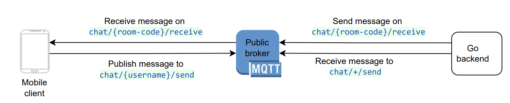

# Tutorial

This tutorial will help you set up an end-to-end chat application for sending and receiving messages using the MQTT protocol.

In this example, we are going to use Courier library for all client(Android & iOS) & backend applications. Find more about these libraries [here](/#docs).

## Components

- **Broker** - For the purpose of this tutorial, you can either can use the [HiveMQ](https://www.hivemq.com/public-mqtt-broker/) public broker or setup your own MQTT broker.

- **Android application** - Check [this tutorial](AndroidSetup) on how to setup the android application

- **iOS application** - Check [this tutorial](iOSSetup) on how to setup the iOS application

- **Backend application** - Check [this tutorial](GoSetup) on how to setup the backend application

## Flow Diagram

Client app(Android or iOS) will connect to the MQTT broker by passing the following information:

- MQTT Broker IP & Port
- Client ID, Username & Password for creating the MQTT connection
- Room code for starting the conversation

Once client app(Android or iOS) connects to the broker, it will subscribe to the topic - `chat/{room-code}/receive`

When client app(Android or iOS) sends a message, it will publish to the topic - `chat/{username}/send`

Backend application subscribes to the topic - `chat/+/send`, in order to listen to all messages published by client applications. This is a [wildcard subscription][1].

Once the backend application receives a message on the above topic, it parses the message payload and publishes the message on the topic subscribed by the client applications.

Message payload format: `{"from":{sender-username},"message":{text-message},"to":{room-code}}`

[1]: https://www.hivemq.com/blog/mqtt-essentials-part-5-mqtt-topics-best-practices/