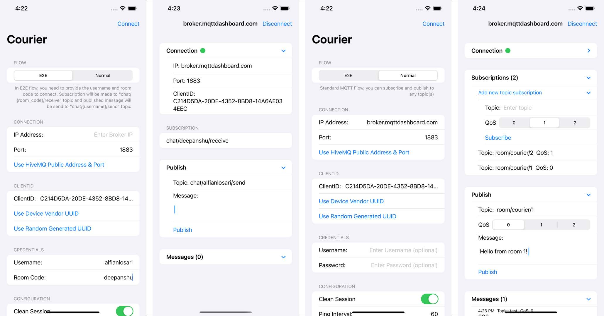

# iOS Setup

iOS sample application for this end-to-end example can be found [here][1]

There are 2 flows that you can choose:
1. E2E, provide username and room code to connect. Subscription will be made to `chat/{room_code}/receive` topic and published message will be send to `chat/{username}/send\` topic.
2. Normal: Standard MQTT Flow, you can add subscriptions and publish to any topic(s).

## Steps
- Clone [this github project][2], if not already done.
- Navigate to `example-ios` folder and run `pod install`.
- Open `CourierE2EApp.xcworkspace`.
- Build and Run using simulator or device.

## E2E Flow Interface
- Enter broker IP, broker port, client id, username, and room code to make the connection.
- On clicking the **CONNECT** button, courier library will make the MQTT connection using the provided connect options and a new screen will appear where all sent/received messages can be seen.

## Normal Flow Interface
- Configure connection (ip, port, clientid, username, password, ping, clean session).
- Subscribe/Unsubscribe topic(s) to broker and visualize current subscriptions.
- Publish message(s) to any topic to broker.
- Display received messages history.

## Requirement
- Xcode 13.

[1]: https://github.com/gojek/courier/tree/main/example-ios
[2]: https://github.com/gojek/courier